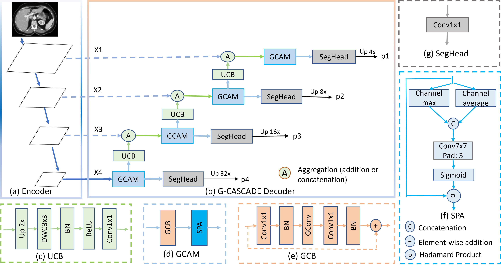
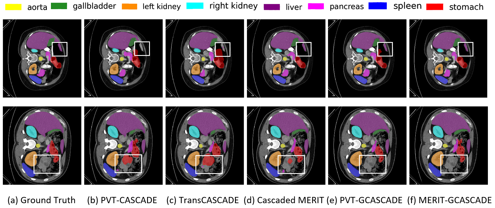

# G-CASCADE

Official Pytorch implementation of [G-CASCADE: Efficient Cascaded Graph Convolutional Decoding for 2D Medical Image Segmentation](https://openaccess.thecvf.com/content/WACV2024/html/Rahman_G-CASCADE_Efficient_Cascaded_Graph_Convolutional_Decoding_for_2D_Medical_Image_WACV_2024_paper.html) WACV 2024. 
[Md Mostafijur Rahman](https://github.com/mostafij-rahman), [Radu Marculescu](https://radum.ece.utexas.edu/)
<p>The University of Texas at Austin</p>

## Architecture

<p align="center">

</p>

## Qualitative Results

<p align="center">

</p>

## Usage:
### Recommended environment:
```
Python 3.8
Pytorch 1.11.0
torchvision 0.12.0
```
Please use ```pip install -r requirements.txt``` to install the dependencies.

### Data preparation:
- **Synapse Multi-organ dataset:**
Sign up in the [official Synapse website](https://www.synapse.org/#!Synapse:syn3193805/wiki/89480) and download the dataset. Then split the 'RawData' folder into 'TrainSet' (18 scans) and 'TestSet' (12 scans) following the [TransUNet's](https://github.com/Beckschen/TransUNet/blob/main/datasets/README.md) lists and put in the './data/synapse/Abdomen/RawData/' folder. Finally, preprocess using ```python ./utils/preprocess_synapse_data.py``` or download the [preprocessed data](https://drive.google.com/file/d/1tGqMx-E4QZpSg2HQbVq5W3KSTHSG0hjK/view?usp=share_link) and save in the './data/synapse/' folder. 
Note: If you use the preprocessed data from [TransUNet](https://drive.google.com/drive/folders/1ACJEoTp-uqfFJ73qS3eUObQh52nGuzCd), please make necessary changes (i.e., remove the code segment (line# 88-94) to convert groundtruth labels from 14 to 9 classes) in the utils/dataset_synapse.py. 

- **ACDC dataset:**
Download the preprocessed ACDC dataset from [Google Drive of MT-UNet](https://drive.google.com/file/d/13qYHNIWTIBzwyFgScORL2RFd002vrPF2/view) and move into './data/ACDC/' folder.

- **Polyp datasets:**
Download the training and testing datasets [Google Drive](https://drive.google.com/file/d/1pFxb9NbM8mj_rlSawTlcXG1OdVGAbRQC/view?usp=sharing) and move them into './data/polyp/' folder.

- **ISIC2018 dataset:**
Download the training and validation datasets from https://challenge.isic-archive.com/landing/2018/ and merge them together. Afterwards, split the dataset into 80%, 10%, and 10% training, validation, and testing datasets, respectively. Move the splited dataset into './data/ISIC2018/' folder. 

### Pretrained model:
You should download the pretrained PVTv2 model from [Google Drive](https://drive.google.com/drive/folders/1Eu8v9vMRvt-dyCH0XSV2i77lAd62nPXV?usp=sharing), and then put it in the './pretrained_pth/pvt/' folder for initialization. Similarly, you should download the pretrained MaxViT models from [Google Drive](https://drive.google.com/drive/folders/1k-s75ZosvpRGZEWl9UEpc_mniK3nL2xq?usp=share_link), and then put it in the './pretrained_pth/maxvit/' folder for initialization.

### Training:
```
cd into G-CASCADE
```

For Synapse Multi-organ dataset training, run ```CUDA_VISIBLE_DEVICES=0 python -W ignore train_synapse.py```

For ACDC dataset training, run ```CUDA_VISIBLE_DEVICES=0 python -W ignore train_ACDC.py```

For Polyp datasets training, run ```CUDA_VISIBLE_DEVICES=0 python -W ignore train_polyp.py```

For ISIC2018 dataset training, run ```CUDA_VISIBLE_DEVICES=0 python -W ignore train_ISIC2018.py```

### Testing:
```
cd into G-CASCADE 
```

For Synapse Multi-organ dataset testing, run ```CUDA_VISIBLE_DEVICES=0 python -W ignore test_synapse.py```

For ACDC dataset testing, run ```CUDA_VISIBLE_DEVICES=0 python -W ignore test_ACDC.py```

For Polyp dataset testing, run ```CUDA_VISIBLE_DEVICES=0 python -W ignore test_polyp.py```

For ISIC2018 dataset testing, run ```CUDA_VISIBLE_DEVICES=0 python -W ignore test_ISIC2018.py```

## Acknowledgement
We are very grateful for these excellent works [timm](https://github.com/huggingface/pytorch-image-models), [MERIT](https://github.com/SLDGroup/MERIT), [CASCADE](https://github.com/SLDGroup/CASCADE), [PraNet](https://github.com/DengPingFan/PraNet), [Polyp-PVT](https://github.com/DengPingFan/Polyp-PVT) and [TransUNet](https://github.com/Beckschen/TransUNet), which have provided the basis for our framework.

## Citations
```
@inproceedings{rahman2024g,
  title={G-CASCADE: Efficient Cascaded Graph Convolutional Decoding for 2D Medical Image Segmentation},
  author={Rahman, Md Mostafijur and Marculescu, Radu},
  booktitle={Proceedings of the IEEE/CVF Winter Conference on Applications of Computer Vision},
  pages={7728--7737},
  year={2024}
}
```
